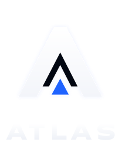

<p align="center">
  
</p>

<h1 align="center">Atlas Self-Hosted</h1>

<p align="center">
  Affiliate and CPA tracking software that runs inside your own infrastructure.<br>
  Clicks, conversions, partners and payouts — on your servers, under your domains.
</p>

<p align="center">
  <a href="https://getatlasbase.com/">Website</a> ·
  <a href="https://getatlasbase.com/en/self-hosted/">Self-hosted edition</a> ·
  <a href="https://docs.getatlasbase.com/">Documentation</a> ·
  <a href="https://getatlasbase.com/en/compare/">SaaS vs self-hosted</a> ·
  <a href="CHANGELOG.md">Changelog</a>
</p>

> This repository is the official binary distribution of **Atlas Self-Hosted**; the release it carries is named in `release.json` and `CHANGELOG.md`. It contains precompiled Atlas binaries, the production Portal web application, Dockerfiles that only copy those local files into images, a complete Docker Compose stack, Kubernetes manifests, and a one-line installer for a clean Linux server. It does not contain the Atlas source code. Atlas is proprietary software: running it requires a license — see [Licensing](#licensing) and [License and support](#license-and-support).

> **Try Atlas free for four months.** Mention the promo code **`GITHUB_PROMO_4M`** when you request a license on [getatlasbase.com](https://getatlasbase.com/en/self-hosted/), and your self-hosted license is free for the first four months — the full product, with no volume limits, on your own servers and domains.

## Table of contents

- [What Atlas is](#what-atlas-is)
- [How it works](#how-it-works)
- [Business functionality](#business-functionality)
- [Roles and access model](#roles-and-access-model)
- [What is included](#what-is-included)
- [Architecture](#architecture)
- [System requirements](#system-requirements)
- [Licensing](#licensing)
- [One-line installation](#one-line-installation)
- [Quick start with Docker Compose](#quick-start-with-docker-compose)
- [Environment files](#environment-files)
- [Running the Portal in a customer network](#running-the-portal-in-a-customer-network)
- [Kubernetes](#kubernetes)
- [Health, version, and verification](#health-version-and-verification)
- [Logs](#logs)
- [Operator tools](#operator-tools)
- [Backup and restore](#backup-and-restore)
- [Upgrade procedure](#upgrade-procedure)
- [Security model](#security-model)
- [Operational boundaries](#operational-boundaries)
- [Troubleshooting](#troubleshooting)
- [Release artifacts and integrity](#release-artifacts-and-integrity)
- [Third-party software](#third-party-software)
- [License and support](#license-and-support)

## What Atlas is

**Atlas is affiliate and CPA tracking software**: the system a business uses to run a partner (affiliate) program or a CPA network. It answers the questions such a business lives on — which partner sent which visitor, which of those visitors became a customer, how much each partner has earned under their deal, and what the network itself made on it — and it does so for every click, in real time, with an audit trail that holds up when a partner or an advertiser disputes a number.

In performance marketing, a business pays partners (publishers, affiliates, media buyers) for results rather than for exposure: for a registration, a first deposit, an order, an app install, a subscription, or a share of the revenue a referred customer brings. That model only works when every party trusts the counting. Atlas is that counting layer:

- **Tracking.** Every partner gets their own tracking links. A click on one is recorded, enriched (country, network, device, browser, language, bot signals), checked against the offer's rules and redirected to the right landing page in milliseconds.
- **Attribution.** When the advertiser's system reports a conversion — through a server-to-server *postback* carrying the click identifier, or through a promo code — Atlas ties it back to the click, the partner, the campaign and the traffic source, and deduplicates it.
- **Money.** The conversion is priced under the partner's deal — CPA, revenue share, hybrid, CPC/CPM, period revenue share over GGR/NGR/deposits/turnover, volume tiers, guarantees and caps — and flows into a payout ledger with holds, approvals, reversals and payout documents. Atlas calculates and records what is owed; it does not move the money.
- **Reporting.** Owners, managers, advertisers and partners each see live statistics, funnels and breakdowns — each strictly limited, on the server, to what they are allowed to see.
- **Protection.** Anti-fraud rules, signed postbacks with anti-replay protection, rate limits and a destination blocklist keep fake traffic and forged conversions out of the numbers that turn into payouts.

### Who it is for

Atlas is built for four operating models, all served by the same product:

1. **Direct advertisers** that run their own partner program without a CPA network in between: the brand owns the offers, recruits partners, and pays them directly.
2. **CPA networks** that sit between advertisers and publishers: advertisers get their own scoped accounts inside the network, offers and partners are managed in one place, and the network sees its revenue and margin on every deal.
3. **Media buying teams and agencies** that buy traffic on ad platforms: campaigns, traffic sources and spend are tracked next to conversions, ROI is computed per campaign, confirmed conversions are returned to the ad account they were bought in, and several clients can be kept apart in one installation.
4. **Enterprises with a strict data perimeter** — regulated industries, iGaming operators, large networks — that cannot send tracking and financial data to an external SaaS. This distribution exists for them.

The vertical is not fixed: conversion goals are defined by the customer, so the same mechanics cover **iGaming** (casino, sports betting, poker — with lifetime player-to-partner binding and revenue share), e-commerce and retail, mobile apps and subscriptions, finance and fintech, services, education, and lead generation.

### Why self-hosted

Atlas is available as a SaaS service and as this self-hosted edition. The self-hosted edition is the full product, not a reduced one:

- **Your data stays with you.** Clicks, conversions, partners, advertisers, offers, payout calculations and user accounts live in your PostgreSQL, ClickHouse, Redis, Kafka and file volumes. Nothing about your traffic or your partners is sent to Atlas.
- **Your domains, your brand.** The portal and the tracking links run on your own portal, tracking and (optionally) postback domains, with your network's name, logo and colours.
- **No volume limits in the license.** The license is issued for one pair of domains and a term; it does not count clicks, conversions, partners or offers. Capacity is decided by your hardware.
- **Your operations.** It runs on one server with Docker Compose, or in your Kubernetes cluster, with health and version endpoints, documented backups and in-place upgrades.

What Atlas is **not**: it does not transfer money to partners (it calculates amounts, issues payout documents and records their payment status), it does not buy traffic or connect to ad-platform APIs, and it is not an ad server.

## How it works

```text
 Partner's ad / site / campaign
          │  click on a tracking link  https://track.your-network.com/c/<code>
          ▼
 ┌─────────────────────────┐   click recorded, enriched, checked against the
 │     Tracking Gateway     │   offer's targeting, schedule, caps and access,
 └─────────────────────────┘   then redirected with a click_id
          │
          ▼
 Advertiser's landing page ──► the visitor registers, deposits, buys…
          │
          │  server-to-server postback  (click_id, goal, amount, token/signature)
          ▼
 ┌─────────────────────────┐   conversion attributed to the click, the partner,
 │     Tracking Gateway     │   the campaign; deduplicated; anti-fraud checks
 └─────────────────────────┘
          │  durable event (Kafka)
          ▼
 ┌─────────────────────────┐   priced under the partner's deal, placed on hold or
 │         Portal           │   approved, collected into payout documents; reports
 └─────────────────────────┘   for the owner, managers, advertisers and partners
```

The key terms used below:

| Term | Meaning |
|---|---|
| **Network** | Your installation of Atlas: the partner program or CPA network you run. A self-hosted installation serves exactly one network |
| **Offer** | What partners promote: a destination (landing pages), conversion goals, payouts, targeting, caps and access rules |
| **Partner** (publisher, affiliate) | Someone who sends traffic to your offers and is paid for results |
| **Advertiser** | The owner of an offer. In a CPA network advertisers have their own scoped accounts; a direct advertiser is simply the network itself |
| **Click / `click_id`** | One visit through a tracking link, and the identifier that later ties a conversion back to it |
| **Conversion** | A result you pay for — a registration, deposit, sale, install — reported by a postback or a promo code |
| **Postback** | A server-to-server request from the advertiser's system reporting a conversion; Atlas can also send postbacks onward to partners and ad accounts |
| **Payout document** | The record of what a partner is owed for a period, which you mark as paid after paying it by your own means |

## Business functionality

This section describes the business surface in detail so that an operator, a security reviewer, a buyer and an implementation team can understand what the installed product does.

### Partner management

- Create and maintain partner profiles: identity, business details, contacts, payment details and notes in one card.
- Move partners between active and suspended states without deleting history; a block takes effect immediately on every sign-in surface and on the tracking hot path.
- Invite a partner to the portal by email when SMTP is configured, or issue access with a password for a network without email. A password issued by somebody else is single-use and time-limited: the session it opens can do nothing but replace it.
- Let partners register themselves when the Network Owner enables it; approval stays with the network.
- Give one partner card several logins — a buying team — with one of them acting as the partner's representative.
- Grant or deny access to individual offers, and define individual payout terms where a deal differs from the offer default.
- Assign a partner to a specific member of network staff, which is also the single axis that narrows what that employee sees.
- Keep private partner relationships, so that an advertiser's offer is not visible to every partner.
- Run a one-level partner referral program: a partner who brings another partner earns a share of that partner's confirmed earnings, paid by the network.
- View the portal as a partner, read-only, for support and diagnostics.

### Offer management

- Create offers with one or more conversion goals and a clear lifecycle status; pause or restrict an offer without losing its history.
- Pay per result with CPA, revenue share, hybrid, CPC and CPM goals; qualify a conversion by a minimum amount in the goal's own currency.
- Target by country, device, operating system, browser and language; schedule offers with flight dates and minute-grade dayparting in an explicit time zone.
- Apply click and conversion caps and goal plans ("100 registrations this month").
- Attach several landing pages, rotate them with weights and compare the variants: clicks, conversions, conversion rate with its confidence range, payout and revenue per click, and a plain verdict on whether the leader is really better.
- Control partner access by policy — public, on request, or private — materialized into an explicit list of per-partner grants.
- Keep an evidentiary history of an offer's terms: what applied when a conversion was attributed, not only what applies now.
- Store promo materials in private portal storage, served only after an authorization check; publish an offer poster and an offer catalog partners can browse.
- Issue promo codes that attribute conversions without a click and inherit their offer's status.

### Tracking, routing and attribution

- Accept high-volume click, landing-page click and impression traffic through the dedicated Tracking Gateway.
- Accept clicks through short link codes only: the code is computed, can be revoked and reissued by generation, and cannot be forged by editing an identifier.
- Route traffic through flows: weighted routes across offers, partner-specific short links, and fallback chains.
- Attribute conversions to the originating click through `click_id`, within the configured attribution window, with deduplication.
- Bind a player to a partner for life where the deal calls for it (iGaming revenue share), so later deposits keep crediting the right partner.
- Check every redirect destination against the network's blocklist before sending the visitor on.
- Keep accepting traffic while downstream systems are degraded, using bounded spill queues.

### Postback security

- Three modes per offer: a plain token for integrations that cannot sign, an observation mode that measures how many postbacks are correctly signed, and a strict mode that requires an HMAC signature.
- Protect signed postbacks with timestamp validation and nonce-based anti-replay.
- Nothing is written before a postback's token is checked, and an unknown click, player or promo code gets the same `401` as a wrong token, so the answer never reveals what exists.
- Keep a trail of accepted and rejected postbacks that an integrator can read to see why a conversion was refused, by the request identifier returned in `X-Atlas-Request-Id`.
- Queue outbound postbacks to partners and ad accounts, retry transient failures, and keep terminal failures in a dead-letter queue an operator can replay.
- Send outbound requests only to publicly routable addresses, so a URL entered in the portal cannot reach your internal network or a cloud metadata endpoint.

### Media buying campaigns

- Let a partner keep their buying campaigns and a directory of traffic sources inside Atlas; the network sees its partners' campaigns, advertisers do not see them at all.
- Address a campaign by its own short link and accept the ad platform's own click identifier alongside the Atlas one.
- Record spend: import it from an ad-platform report (a re-upload of the same file changes nothing) or carry it in the link; a trusted entry for a day supersedes an untrusted one without deleting it.
- Show profit and ROI per campaign within one currency, and leave them empty rather than guess when spend and payout differ in currency.
- Return a confirmed conversion to the ad account it was bought in; the address lives on the traffic source, so a broken integration is fixed by one edit.
- Reconcile a campaign: where the clicks went for a period and conversions by status, with reasons shown to the partner only where they describe the partner's own settings.

### Anti-fraud

- Run anti-fraud rules and investigations entirely inside your installation.
- Test a rule against history and observe it before it acts; a rule cannot go straight to blocking.
- Block a suspicious click at intake; place a suspicious conversion on hold for a human decision rather than rejecting it automatically.
- Keep every verdict reproducible: which rule, which version, which values and which data led to it.
- Detect registration farms by counting conversions of one goal from the same visitor address, without storing the address itself.
- Receive signed reputation packages (network, IP range and email-domain reputation) with the corresponding subscription; without it, local rules work and reputation signals stay unknown.

### Reporting and analytics

- Live KPIs for clicks, landing clicks, conversions and conversion rate, compared with the previous period.
- Activity over time in a selectable time zone, click-to-conversion funnels, and breakdowns by country, device, operating system, browser, referrer, partner, flow and other dimensions.
- Dayparting heatmaps, near-real-time counters and recent click and conversion feeds.
- An Analytics section for investigation: a report builder, partner cohorts and a per-click passport, with raw-event export kept apart from the report itself.
- A customizable dashboard with several named tabs per user, a widget catalog limited by role, and "needs attention" signals for each role.
- Every figure scoped on the server: a partner sees their own traffic, an advertiser their own offers, a manager their assigned partners.

### Payouts and financial operations

- A transactional payout ledger fed by conversions, with the payout basis frozen at the moment of conversion.
- Hold, approve, reject and reverse conversions under explicit state rules, protected from stale concurrent edits.
- A catalog of reward models rather than a single percentage: period revenue share over a configurable base (turnover, GGR, NGR, deposits, rake or a custom formula), share scales, marginal scales, retroactive volume tiers, volume tiers in money, fixed fees, guarantees and caps, and a share expiration window.
- The network's own revenue and margin on every deal, computed by the same engine as the partner's share.
- Preview a period, close it from a consistent snapshot, and issue immutable payout documents — or issue one early when the situation calls for it.
- Mark documents as paid; keep reversal and clawback history without rewriting an issued document.
- Record advertiser listing fees separately from partner commissions.
- Refuse to close a period while the event ledger is incomplete, rather than close it with missing conversions.

### Advertiser accounts

- Advertiser cards inside the network, each with its own account and sub-accounts for its staff.
- Advertiser scope enforced by the backend: an advertiser sees only its own offers, landing pages, statistics, conversions and payouts, and closes payouts on its own offers.
- View the portal as an advertiser, read-only, for support.

### API access

- A versioned public API (`/api/v1`) described by an OpenAPI contract that the portal serves for offline use.
- Personal API keys that inherit the user's permissions, and service keys owned by the network with explicit scopes.
- Key secrets shown once, at creation or rotation; rotation with a grace period.
- Per-key, per-network and heavy-report rate limits, unlimited by default in the self-hosted edition.
- Bearer requests over plain HTTP refused rather than redirected, because the redirect would come too late for the credential.

### Accounts, security and the activity journal

- One activity journal with the client address, written in the same transaction as the change it records; a network-wide journal for the owner and a personal security view for every user.
- Every user changes their own password with the current one, and every other session of that user is closed.
- Self-service password reset over the network's own email for every role, including the owner, answering identically for known and unknown addresses.
- One password policy: length and a dictionary of known-bad passwords.
- Operator recovery for an owner who cannot sign in, without any vendor involvement.

### Settings, branding and data import

- Network name, time zone, currency and email (SMTP) settings with a connection test; the SMTP password is encrypted at rest.
- The network's domains as a set with exactly one primary: a domain is changed by adding an alias and retiring the old one, so links already handed out keep working.
- Your own name, logo, favicon and colour scale on every screen, including sign-in, registration and password recovery.
- Import partners and offers from CSV, with a journal of what was created and what was updated.
- Contacts for enquiries: each staff member keeps the contacts partners should use, separate from their sign-in address.

### First-run wizard and license activation

- A new installation opens a browser wizard protected by a one-time setup code: network name and time zone, the portal and tracking domains (with the DNS records to create and a live check of each), the Network Owner account created over HTTPS on your own domain, then license activation and email.
- The license is activated by pasting it into the portal; the Network Owner can later replace, restore or remove it in Settings → License.

## Roles and access model

Atlas enforces permissions on the server. Hiding a button in the web application is never treated as an authorization boundary.

| Role | Who it is | Scope |
|---|---|---|
| Network Owner | The customer running the network | The whole installation: settings, staff, API policy, license, branding, impersonation |
| Affiliate Manager | Network staff | Offers, partners, statistics and conversion review across the network, or only for the partners assigned to them; payouts and partners' payment details only with explicit financial access |
| Advertiser | The owner of offers inside a CPA network | Its own offers, landing pages, statistics, promo codes and payouts; manages its sub-accounts |
| Advertiser Manager | An advertiser's staff member | The same as the Advertiser, except money and sub-accounts unless granted |
| Partner (Publisher) | Someone who sends traffic | Their own offers, links, campaigns, statistics, earnings and payout documents; one partner card may have a team of logins |

A direct advertiser does not use the Advertiser roles: the Network Owner does that work. A two-tier partner structure is expressed through the referral program.

A self-hosted installation serves exactly one network (`tenant_id=1`, PostgreSQL schema `client_1`). It must not be used to host several networks.

## What is included

```text
atlas-self-hosted/
├── artifacts/
│   ├── linux-amd64/
│   │   ├── atlas-portal                 Portal API
│   │   ├── atlas-gateway                Tracking Gateway
│   │   ├── atlas-migrate                Gateway PostgreSQL/ClickHouse migrator
│   │   ├── atlas-setup-code             operator tool: first-run wizard setup code
│   │   ├── atlas-config-backfill        operator tool: configuration topic recovery
│   │   ├── atlas-payouts-quarantine     operator tool: payout ledger quarantine
│   │   ├── atlas-outbound-deliveries    operator tool: outbound postback dead-letter queue
│   │   ├── atlas-rotate-secrets         operator tool: re-encrypt secrets at rest
│   │   ├── atlas-reset-owner-password   operator tool: Network Owner recovery
│   │   └── atlas-update-check           operator tool: release signature check and update channel
│   └── frontend/                        production Portal web application, fonts included
├── assets/                              Atlas logo and favicon
├── config/
│   ├── caddy/                           edge: configuration renderer and entrypoint
│   ├── clickhouse/                      ClickHouse custom-setting prefix
│   ├── enrichment/                      device and datacenter enrichment data
│   └── kafka/                           topic initialization script
├── docs/backup-restore.md               backup and restore runbook
├── env/                                 one example env file per service
├── images/                              Dockerfiles that copy local artifacts only
├── k8s/                                 Kubernetes reference manifests and guide
├── scripts/                             installer, configuration and verification helpers
├── docker-compose.yml                   complete single-server stack
├── Makefile                             lifecycle shortcuts
├── CHANGELOG.md                         release history
├── UPGRADE.md                           upgrade steps of every release
├── SHA256SUMS                           checksums of the binaries
├── release-index.json                   file list, sizes and checksums of this release
├── release-index.sig                    the release index signed with the Atlas release key
├── release.json                         machine-readable version and build identity
├── SECURITY.md                          vulnerability reporting
├── THIRD_PARTY_NOTICES.md               licenses of bundled third-party software and data
└── LICENSE.md                           license notice
```

Not included: managed database services, a certificate authority other than the automatic one in `direct` mode, DNS automation, HA topology, alert routing, backup storage, or customer-specific sizing.

## Architecture

```text
Users ── HTTPS ──> portal.example.com ──> Edge (Caddy) / Ingress ──> Portal web application
                                                        └─────────> Portal API

Traffic ── HTTPS ─> track.example.com ──> Edge (Caddy) / Ingress ─> Tracking Gateway
Postbacks ─ HTTPS > pb.example.com (optional) ─────────────────────> Tracking Gateway

Portal API ───────> Portal PostgreSQL
         ├────────> ClickHouse (read-only analytics path)
         └────────> Kafka (configuration, payout ledger, outbound events)

Tracking Gateway ─> Gateway PostgreSQL (materialized tracking configuration)
                 ├> ClickHouse (event analytics)
                 ├> Redis (click context, limits, anti-replay, spill queues)
                 └> Kafka (durable event transport)
```

The two PostgreSQL databases have different owners:

- **Portal PostgreSQL** is the source of truth for users, roles, advertisers, partners, offers, settings, payout documents, API keys and other business state.
- **Gateway PostgreSQL** is the Tracking Gateway's configuration read model. The Portal publishes configuration changes through Kafka; the Gateway materializes them for its hot path.

ClickHouse stores high-volume event analytics and is not the only copy of any critical business state. Redis holds operational state for the hot path. Kafka decouples intake, analytics, configuration, payouts and outbound delivery, so each can recover independently.

The edge is Caddy. It serves the web application, routes each host to its service, publishes an explicit route list rather than everything a service serves, and in `direct` mode obtains and renews TLS certificates itself.

## System requirements

### Minimum server

- a Linux x86-64 server; the one-line installer is written for current Debian and Ubuntu releases (Debian 12 and 13, Ubuntu 22.04, 24.04 and 26.04 LTS);
- 2 vCPU, 4 GB RAM, 100 GB of persistent storage;
- Docker Engine with the Compose v2 plugin, in a release that still receives security updates (the installer installs the current one);
- two DNS names — portal and tracking — pointing at the server, plus an optional third one for postbacks;
- in `direct` mode, ports 80 and 443 reachable from the internet; in `proxy` mode, your own TLS reverse proxy or load balancer.

### Throughput

A single Linux server with **2 CPU cores and 4 GB of RAM**, running the complete stack, accepts about **800 requests per second** of tracking traffic — clicks, impressions and postbacks. For scale: that rate held for a full day would be roughly **69 million events** (800 × 86,400 ≈ 69.1 million).

800 requests per second is the **peak** such a server can take, not a level to run at every day. For stable operation, give the installation more resources than the minimum, so that traffic spikes, report queries and background work have headroom. You can scale the server's resources at any time as your actual traffic grows — the installation does not need to be sized for the future on day one.

### Recommended starting point for production

- 8 vCPU and 16–32 GB RAM;
- SSD-backed storage;
- separate storage or managed services for both PostgreSQL databases and ClickHouse;
- monitored disk capacity and inode use;
- encrypted off-host backups;
- an explicit retention and capacity plan for Kafka and ClickHouse;
- a customer-controlled container registry for Kubernetes.

Beyond the figure above, size the system against click, impression and conversion rates, report concurrency, retention, offer and partner counts, and recovery objectives.

The binaries are built for `linux/amd64` only. Docker cannot convert them for another architecture at image build time.

## Licensing

Atlas Self-Hosted runs on a license issued to your company for your installation's domains — the portal domain and the tracking domain (and the postback domain, where you use one). **An installation without a confirmed license does not serve traffic**: the portal shows the license activation screen instead of the sign-in page, and the tracking domains do not accept clicks or postbacks. Health and version endpoints keep answering, so the state is easy to diagnose.

To get started, request a license on [the self-hosted page](https://getatlasbase.com/en/self-hosted/) and mention the promo code **`GITHUB_PROMO_4M`**: the first four months of Atlas Self-Hosted are free. For a short evaluation there is also a [demo license](https://docs.getatlasbase.com/en/self-hosted/demo-license/). A license is issued for exact domain names, so decide on them first.

### Activating the license in the portal

On Docker Compose the simplest path is to activate the license in the portal itself — no file to edit and no restart:

- **Activation before sign-in.** Until the installation has a confirmed license, the portal shows an activation screen with the reason, the installation's domains, its installation ID and version (with a copy button for your Atlas account manager), and a field for the license. Paste it and click **Activate**; when the portal and traffic intake have both confirmed it, the screen offers **Sign in**.
- **Settings → License (Network Owner only).** Shows where the license comes from and whether traffic intake has confirmed it, and lets the owner **replace** the license, **restore** the previous one or **remove** it. Removing the license stops Atlas until a license is installed again.

The license installed in the portal is kept in the `atlas-license` volume; back it up with the other volumes.

### Delivering the license through configuration

For Kubernetes, automated and air-gapped installations, deliver the license as `ATLAS_LICENSE_TOKEN` (a single value) or `ATLAS_LICENSE_FILE` (a path to a mounted license file) — see `env/portal.env.example`, `env/gateway.env.example`, the commented mounts in `docker-compose.yml`, and "License delivery" in [k8s/README.md](k8s/README.md). **Set the same license in Portal and Gateway.** While `ATLAS_LICENSE_TOKEN` is set, the license is managed by the server configuration and cannot be replaced from the portal.

Where the domains are set by configuration rather than in the first-run wizard (`ATLAS_LICENSE_*_DOMAIN(S)`, as in the Kubernetes manifests), set them to exactly the domains of the license.

### Network access

Both services confirm the license with Atlas over the internet, so the installation needs outbound HTTPS (see [Firewall policy](#firewall-policy)). An installation with no outbound access at all can run in isolated mode (`ATLAS_LICENSE_ISOLATED=true` with an offline license file); ask your Atlas contact for one.

**What is sent to Atlas.** The license, the product version, which service is asking, the installation ID and host name, and the domain names the installation serves. **No customer data is sent** — no traffic, partner, advertiser or end-user data, and no credentials. The installation ID is shown in Settings → License; quote it when you contact support. Clause 5.8 of the [Atlas License Agreement](https://docs.getatlasbase.com/en/legal/license/) states the same in contractual terms.

### Expiry

Renew the license before its term ends; Settings → License shows the term. After the term ends, tracking keeps working for a grace period so that no traffic is lost, while administrative actions — creating offers, closing payout periods and confirming or paying payouts — are paused until the license is renewed. Nothing is lost: everything resumes once the renewed license is confirmed.

The client-facing reference for Settings → License and the activation screen is at [docs.getatlasbase.com](https://docs.getatlasbase.com/en/self-hosted/license/).

## One-line installation

For a clean **Debian or Ubuntu x86-64 server** (at least 2 vCPU, 4 GB of memory and 100 GB of disk), run as root or with sudo:

```bash
curl -fsSL https://raw.githubusercontent.com/atlasbase-solutions/atlas-self-hosted/main/scripts/install.sh | sudo sh
```

The installer asks no questions. It:

1. checks the server (a smaller one gets a warning, not a refusal; in `direct` mode ports 80 and 443 must be free);
2. installs Docker Engine and the Docker Compose plugin from Docker's official apt repository when they are not already available — it changes nothing else on the host;
3. downloads this distribution, verifies every binary against `SHA256SUMS` and every file of the distribution against the release index signed with the Atlas release key, and refuses to continue if the distribution is not signed by Atlas or any file is changed, missing or not listed in the index;
4. creates `/opt/atlas`, generates independent random database and encryption secrets and writes the service env files (readable by root only);
5. builds the images, starts the Compose stack and checks it from inside the server;
6. registers a one-time **setup code** and saves the wizard link `http://<server IP>/setup#code=...` to `/root/atlas-setup.txt` (readable by root only). The link is also printed when you run the command in a terminal, and the login message reminds you about it until setup is complete.

Open the link in a browser. The **first-run wizard** asks for the network name and time zone, the portal and tracking domains (it shows the DNS records to create and checks them), creates the Network Owner over HTTPS on your portal domain, and then offers license activation and email settings. Certificates are issued automatically once a domain points at the server. Nothing about your network is typed into the server.

Lost the link, or the code is locked after too many wrong attempts? Run `sudo atlas-setup-code` on the server: it issues a new code (the previous one stops working) and prints the new link.

### Cloud-init and provider templates

The same command works as cloud-init user data:

```yaml
#cloud-config
runcmd:
  - curl -fsSL https://raw.githubusercontent.com/atlasbase-solutions/atlas-self-hosted/main/scripts/install.sh | sh
```

When the server is ready, connect over SSH and run `sudo cat /root/atlas-setup.txt`. A provider template that can generate a value and show it on the server page passes it as the setup code:

```sh
#!/bin/sh
curl -fsSL https://raw.githubusercontent.com/atlasbase-solutions/atlas-self-hosted/main/scripts/install.sh | ATLAS_SETUP_CODE="$GENERATED_VALUE" sh
```

and its instructions show `http://<server IP>/setup#code=<value>`.

### Installer settings

All optional, passed as environment variables (`curl ... | sudo VAR=value sh`):

| Variable | Default | Meaning |
|---|---|---|
| `ATLAS_INSTALL_DIR` | `/opt/atlas` | installation directory; the installer never overwrites an existing one |
| `ATLAS_REPOSITORY` | this repository | an approved HTTPS mirror |
| `ATLAS_SOURCE_DIR` | — | an already downloaded distribution directory, for a server without GitHub access; verified the same way |
| `ATLAS_EDGE_MODE` | `direct` | `proxy` to run behind your own TLS load balancer (see [Edge modes](#edge-modes)) |
| `ATLAS_HTTP_PORT` | `8080` | edge port in `proxy` mode |
| `ATLAS_SETUP_CODE` | generated | a setup code generated outside (provider template): 24 letters and digits |
| `ATLAS_PUBLIC_IPS` | detected | public addresses of the server, shown in the wizard's DNS table and used in the link |
| `ATLAS_PORTAL_DOMAIN`, `ATLAS_TRACKING_DOMAIN` | — | both or neither: domains set by configuration; the wizard shows them read-only |
| `ATLAS_OWNER_EMAIL`, `ATLAS_OWNER_PASSWORD` | — | both or neither, together with the domains: the Network Owner is created at startup and there is no wizard. The password is never printed and must be replaced at the first sign-in |

The installer has no version selector: the repository exposes one current release. The license is not an installer input: activate it in the portal after the wizard. Until then the stack is healthy but application traffic is refused, as described in [Licensing](#licensing).

A server behind the provider's NAT has no public address on its network interfaces. The link then shows its private address and the installer says so: replace it with the address you connect to, or pass `ATLAS_PUBLIC_IPS`.

The one-line installer is for a new single-server installation. Use the manual procedure below when you need custom networks, external data services, air-gapped delivery, Kubernetes, or pre-approved secret management.

## Quick start with Docker Compose

### 1. Verify the release

```bash
make verify-release
```

This checks every binary against `SHA256SUMS` and every file of the distribution against the signed release index, and prints the key fingerprint. Compare it with the one under [Release artifacts and integrity](#release-artifacts-and-integrity).

### 2. Create the working env files

```bash
make prepare        # or ./scripts/prepare-env.sh
```

This creates one working file next to every `env/*.env.example` file. It never overwrites an existing one, and Git ignores the working files.

### 3. Replace every placeholder

Replace every `CHANGE_ME` value with a separate random secret — `openssl rand -hex 32` produces one:

- `POSTGRES_PASSWORD` in `env/portal-postgres.env`, and the same password inside `PORTAL_DATABASE_URL` in `env/portal.env`;
- `POSTGRES_PASSWORD` in `env/gateway-postgres.env`, and the same password inside `PG_DSN` in `env/gateway.env`;
- `CLICKHOUSE_PASSWORD` in `env/clickhouse.env`, and the same password inside `CLICKHOUSE_DSN` (`env/gateway.env`) and `PORTAL_CLICKHOUSE_URL` (`env/portal.env`);
- `PORTAL_SECRET_KEY` in `env/portal.env` — exactly 32 random bytes in hex or base64;
- `ATLAS_CONFIG_SECRET_KEY` — the same value in `env/portal.env` and `env/gateway.env`, same format.

Leave the domains, the owner and the license empty to enter them in the first-run wizard. To set them by configuration instead, fill in `ATLAS_PORTAL_HOST`/`ATLAS_TRACKING_HOST` in `env/edge.env`, the `ATLAS_LICENSE_*_DOMAIN(S)` values in both service files, and `PORTAL_OWNER_EMAIL`/`PORTAL_OWNER_PASSWORD` in `env/portal.env`.

### 4. Validate the configuration

```bash
make check          # or ./scripts/check-config.sh
```

The check fails if a working env file is missing, if a `CHANGE_ME` placeholder remains, if an encryption key is not 32 random bytes, if a trusted proxy network is too wide, if the edge mode is inconsistent with its ports, or if Docker Compose cannot render the model.

### 5. Build the images and start

```bash
make up
```

The Dockerfiles do not download or compile Atlas: they copy the local binaries and web application into runtime images. Infrastructure images are pulled from their pinned public tags.

The first start:

1. starts PostgreSQL, ClickHouse, Redis and Kafka, and prepares the license and installation volumes;
2. creates the Kafka topics;
3. applies the Gateway's PostgreSQL and ClickHouse migrations, without demo data;
4. starts the Portal, which applies its own migrations and creates the network's schema;
5. starts the Tracking Gateway and the edge.

### 6. Open the first-run wizard

Issue a setup code and open the wizard on the server's address:

```bash
docker compose --env-file env/compose.env exec portal atlas-setup-code
```

Open `http://<server address>/setup` and enter the code, or `http://<server address>/setup#code=<code>`. The wizard walks through the network, the domains, the Network Owner, the license and email. If you set the owner by configuration instead, sign in at the portal domain with that password and replace it, as the portal requires.

### Common lifecycle commands

```bash
make status
make logs
make restart
make down
```

`make down` removes containers and networks but keeps the named volumes. Do not add `-v` unless permanent data deletion is intended and a verified backup exists.

## Environment files

Atlas deliberately does not use one monolithic env file.

| Example file | Consumed by | Purpose |
|---|---|---|
| `env/compose.env.example` | Docker Compose CLI | Release tag, edge mode (`direct`/`proxy`, shared with the portal) and the published edge ports |
| `env/edge.env.example` | `edge` | Optional host names that win over the wizard, and the subnet of an external TLS proxy allowed to report client addresses |
| `env/portal.env.example` | `portal` | Portal runtime, optional owner bootstrap, limits, secrets, license, analytics and Kafka connections |
| `env/gateway.env.example` | `gateway`, `gateway-migrate` | Tracking runtime, data connections, windows, limits, encryption, license and enrichment paths |
| `env/portal-postgres.env.example` | `portal-postgres` | Portal database name and credentials |
| `env/gateway-postgres.env.example` | `gateway-postgres` | Gateway database name and credentials |
| `env/clickhouse.env.example` | `clickhouse` | Analytics database and credentials |
| `env/kafka.env.example` | `kafka` | Single-node KRaft broker configuration |

Every variable is described in its example file. The examples contain placeholders only; never commit working env files.

### Important Portal variables

| Variable | Meaning |
|---|---|
| *(edition)* | Not a variable. This distribution is the self-hosted edition because that is how its binaries were built; a `PORTAL_EDITION` line in an env file is a startup error. `GET /version` reports the edition of a running process |
| `PORTAL_OWNER_EMAIL`, `PORTAL_OWNER_PASSWORD` | Optional. Both empty: the first-run wizard creates the owner. Both set: the owner is created at startup on an empty database, and must replace the password at the first sign-in. One without the other stops the portal |
| `PORTAL_SECRET_KEY` | Encrypts SMTP credentials at rest. Exactly 32 random bytes in hex or base64 (`openssl rand -hex 32`); a passphrase is refused at startup |
| `PORTAL_SECRET_KEY_PREVIOUS` | Read-only transition key, set only while a key rotation is in progress (see [Rotating an encryption key](#rotating-an-encryption-key)) |
| `ATLAS_CONFIG_SECRET_KEY` | Encrypts offer signing secrets; shared with the Gateway byte for byte. Same format |
| `PORTAL_APP_URL` | Portal address used in emailed links. Empty: `https://<portal domain>` from the wizard |
| `PORTAL_TRACKING_DOMAIN` | Tracking host printed in partner links. Empty: the wizard's tracking domain |
| `PORTAL_CLICKHOUSE_URL` | ClickHouse HTTP address for reports |
| `PORTAL_KAFKA_BROKERS` | Kafka brokers for configuration publishing, the payout ledger and outbound events |
| `PORTAL_FILE_STORAGE_DIR` | Private promo-file storage |
| `PORTAL_API_REQUIRE_HTTPS` | Rejects plain-HTTP `/api/v1` bearer requests when true |
| `PORTAL_TRUSTED_PROXY_CIDRS`, `PORTAL_EXTERNAL_PROXY_CIDRS` | The installation's own subnet, and the subnet of an external TLS proxy when you run one. A network wider than /16 (IPv4) or /64 (IPv6) is refused at startup |
| `PORTAL_TEMP_PASSWORD_TTL_HOURS` | How long a password issued by somebody else stays usable |
| `ATLAS_INSTALLATION_FILE` | Where the portal publishes the installation's domains for the edge and the Gateway |
| `ATLAS_LICENSE_TOKEN`, `ATLAS_LICENSE_TOKEN_FILE`, `ATLAS_LICENSE_FILE`, `ATLAS_LICENSE_ISOLATED`, `ATLAS_LICENSE_*_DOMAIN(S)` | The license (see [Licensing](#licensing)); identical in the Gateway |
| `PORTAL_GATEWAY_INTERNAL_URL` | Where the portal reads the Gateway's license state |
| `OUTBOUND_ALLOWED_TARGET_CIDRS` | Internal networks a user-entered address may reach (receiver test, SMTP); the same value as in the Gateway. Empty is normal; never `0.0.0.0/0` |
| `ATLAS_LOG_*` | Log channels and the daily file (see [Logs](#logs)); identical names in the Gateway |

### Important Gateway variables

| Variable | Meaning |
|---|---|
| `PG_DSN`, `CLICKHOUSE_DSN`, `REDIS_ADDR`, `KAFKA_BROKERS` | Data connections |
| `TRUSTED_PROXY_CIDRS`, `EXTERNAL_PROXY_CIDRS` | The installation's own subnet, and an external TLS proxy's subnet. A network wider than /16 (IPv4) or /64 (IPv6) is refused |
| `METRICS_ADDR` | Internal metrics listener, `:9108` by default; never published by the edge. Must differ from `HTTP_ADDR` |
| `ATLAS_CONFIG_SECRET_KEY` | Must match the Portal exactly |
| `CLICK_CONTEXT_TTL`, `ATTRIBUTION_WINDOW` | Click context lifetime and the maximum attribution window |
| `UNIQUE_CLICK_WINDOW`, `UNIQUE_IMPRESSION_WINDOW` | Windows that make a click or an impression "unique" in reports |
| `HMAC_TIMESTAMP_WINDOW`, `NONCE_TTL` | Signed-postback clock window and anti-replay; the nonce TTL must be at least twice the window |
| `CLICK_RATE_LIMIT_RPS`, `IMPRESSION_RATE_LIMIT_RPS` | Intake ceilings per client address |
| `POSTBACK_RATE_LIMIT_RPS`, `POSTBACK_IP_RATE_LIMIT_RPS` | Postbacks per second per offer, and the early ceiling per client address checked before parsing |
| `PUBLISHER_ACCESS_TTL`, `PROMO_CACHE_TTL`, `BINDING_CACHE_TTL` | Hot-path cache lifetimes; the first is an access-control safeguard, not a memory setting |
| `OUTBOUND_ALLOWED_TARGET_CIDRS` | Internal networks outbound postbacks may reach; the same value as in the Portal |
| `PG_POOL_MAX_CONNS` | PostgreSQL pool size; replicas × pool size must fit `max_connections` |
| `CLICK_SPILL_ENABLED`, `IMPRESSION_SPILL_ENABLED` | Bounded queues that keep intake running while event publication is unavailable |
| `ATLAS_ACCESS_LOG`, `ATLAS_ACCESS_LOG_SAMPLE` | Intake access log; `off` by default because it is the largest log an installation produces |
| `ATLAS_LICENSE_*`, `ATLAS_INSTALLATION_FILE` | The license and the installation's domains, as in the Portal |

### Reputation packages and configuration quarantine

`ATLAS_ANTIFRAUD_FEED_DIR=/var/lib/atlas/antifraud/current` is shared by both services. Compose mounts the parent `antifraud-feed` volume writable in the Portal and read-only in the Gateway. The Portal publishes verified packages atomically; the Gateway verifies each package again and reloads it every `ANTIFRAUD_FEED_RELOAD_INTERVAL` (default `5m`). The package endpoint, `https://antifraud.getatlasbase.com`, is built into the Portal and cannot be changed by configuration; the Portal requests packages only while the license includes the reputation-data subscription. Allow outbound HTTPS to that host when you have the subscription. Without it, local anti-fraud rules still work and reputation signals remain unknown.

The `config-quarantine` Kafka topic keeps configuration events the Gateway could not apply for 30 days. Monitor it together with Gateway configuration errors: a quarantined update is skipped so that other updates continue, but its configuration is not applied until the cause is fixed and the configuration is published again.

### Checking for a new release

```sh
docker compose --env-file env/compose.env run --rm \
  --entrypoint atlas-update-check portal -installed 1.0.12
```

The tool presents the installation's license to Atlas, verifies the signed answer and reports the current release. Atlas answers only a valid license; otherwise the tool shows the license status. To download the release, mount an operator-owned writable directory and add `-download /downloads/<version>` (a new or empty directory): the tool fetches the `vX.Y.Z` archive of this repository from GitHub, unpacks it and keeps it only if every file matches the Atlas release signature. It installs and restarts nothing; read `UPGRADE.md` before replacing a running installation. An isolated installation can download the release on another machine and check the copied directory with `atlas-update-check -verify`.

## Running the Portal in a customer network

Use separate host names:

- `portal.example.com` for people: the web application and the Portal API;
- `track.example.com` for public click and impression intake;
- optionally `pb.example.com` for server-to-server postbacks — without it, postbacks are accepted on the tracking host.

Keeping click and postback hosts apart means a click domain that lands on an ad-blocker list does not stop conversion intake.

### Edge modes

`ATLAS_EDGE_MODE` in `env/compose.env` selects how the edge faces the internet; the same value reaches the portal.

- **`direct`** (default) — a server of its own. The edge listens on `80` and `443`, obtains and renews certificates for the portal, tracking and postback names itself (ACME: HTTP-01 on port 80, TLS-ALPN on 443) and keeps them in the `edge-data` volume. Plain HTTP on a known name redirects to HTTPS, except certificate-authority checks; the portal name sends HSTS. After setup, an IP address or an unknown name gets `404`. There is no proxy in front, so the edge takes the client address from the connection and discards any `X-Forwarded-*` a client sends. Both ports must be reachable from the internet, and a CAA record, if you have one, must allow Let's Encrypt.
- **`proxy`** — your TLS load balancer or reverse proxy terminates TLS and forwards plain HTTP to `ATLAS_HTTP_PORT`. Set `ATLAS_HTTP_PORT=8080` (or any free port), `ATLAS_HTTPS_BIND=127.0.0.1`, an empty `ATLAS_HTTPS_PORT`, and name the proxy network in `ATLAS_EDGE_TRUSTED_PROXY_CIDR` (see below).

Host names come from the first-run wizard: the portal writes them to `installation.json` in the `atlas-installation` volume and the edge picks up a change within 5 seconds, without a restart. `ATLAS_PORTAL_HOST`, `ATLAS_TRACKING_HOST` and `ATLAS_POSTBACK_HOST` in `env/edge.env`, when set, win over the wizard. Until the portal and tracking names are known, the edge serves the setup wizard on plain HTTP for any name or IP. A new configuration that cannot be applied is logged and the previous one keeps serving; `docker compose --env-file env/compose.env exec edge atlas-edge-render` prints the configuration the edge would use now. `make test-edge` checks the edge's route contract in both modes on throwaway containers, without touching a running installation.

### Recommended network path (`proxy` mode)

```text
Corporate users / Internet
          │
          ▼
Customer firewall or WAF
          │
          ▼
TLS load balancer / reverse proxy
          ├── Host: portal.example.com ──> Atlas host :8080 ──> edge ──> web application / Portal
          └── Host: track.example.com  ──> Atlas host :8080 ──> edge ──> Gateway
```

### Firewall policy

- Inbound: TCP 80 and 443 to the Atlas host in `direct` mode; in `proxy` mode, TCP 443 to your TLS endpoint and `ATLAS_HTTP_PORT` from that endpoint only.
- Never expose PostgreSQL 5432, ClickHouse 8123/9000, Redis 6379, Kafka 19092 or the Gateway metrics port 9108 publicly. The Compose stack publishes none of them.
- Restrict SSH and Docker access to your operations network.
- Outbound from Portal and Gateway: HTTPS (TCP 443) to Atlas for the license check and the update check, unless the installation runs in isolated mode with an offline license file. If your firewall allows only named hosts, ask your Atlas contact for the list.
- Outbound from the Portal: HTTPS to `antifraud.getatlasbase.com` when you have the reputation-data subscription; your SMTP relay when email is configured.
- Outbound from the Gateway: the receivers of your outbound postbacks.
- Outbound from the edge in `direct` mode: the ACME certificate authorities (Let's Encrypt, with ZeroSSL as Caddy's fallback).

### What the edge publishes

The tracking host serves the intake routes only — clicks, landing-page clicks, impressions, postbacks, the public refusal preview, `/health/*` and `/version` — and answers `404` to anything else. A separate postback host serves postbacks, `/health/*` and `/version`. The portal host serves `/api/*`, `/internal/*`, `/health/*`, `/version` and the web application. Gateway metrics live on a separate internal address (`METRICS_ADDR`, `:9108`): traffic volumes, refusal rates and anti-fraud signals are your commercial data. Readiness and startup answer with a status only; the reason is in the service log. Postback access-log lines are written without the query string, because it carries the receiver's token.

### TLS reverse proxy requirements (`proxy` mode)

The proxy must:

- preserve the original `Host` header;
- set `X-Forwarded-Proto: https` and the client address headers;
- forward plain HTTP to the edge;
- allow request bodies up to the configured promo upload size (`PORTAL_FILE_MAX_SIZE_MB`);
- use request timeouts suitable for the Portal API while keeping intake timeouts short;
- never serve `PORTAL_FILE_STORAGE_DIR` directly.

Name the proxy's subnet in `ATLAS_EDGE_TRUSTED_PROXY_CIDR` (`env/edge.env`) and in `PORTAL_EXTERNAL_PROXY_CIDRS` / `EXTERNAL_PROXY_CIDRS`; leave `PORTAL_TRUSTED_PROXY_CIDRS` and `TRUSTED_PROXY_CIDRS` at the installation's own subnet. They are separate variables so that adding your balancer does not replace the subnet Atlas already needs. With the edge default `127.0.0.1/32`, and always in `direct` mode, the edge replaces whatever a client sends in `X-Forwarded-For` and `X-Forwarded-Proto` with what it observed itself. A network wider than /16 (IPv4) or /64 (IPv6), or `0.0.0.0/0`, is refused at startup: trusting a whole private range makes every visitor look like one address and lets a client forge its own.

### DNS and certificates

Create A/AAAA records for the portal, tracking and (optional) postback names; the wizard shows them and checks each one. In `direct` mode the edge issues the certificates itself; in `proxy` mode issue them on your proxy.

Changing a tracking domain later is done in the portal by adding the new domain as an alias and retiring the old one, so links already handed out keep working. The license must cover the new domain first.

## Kubernetes

The `k8s/` directory contains a complete single-cluster reference installation:

- a namespace with baseline Pod Security enforcement and restricted audit/warn labels;
- a runtime ConfigMap and a Secret example;
- single-replica StatefulSets for both PostgreSQL databases, ClickHouse, Redis and Kafka;
- Kafka topic and Gateway migration Jobs;
- Portal, Gateway and edge Deployments with startup, liveness and readiness probes;
- Services, PersistentVolumeClaims and a two-host Ingress;
- Kustomize image overrides.

The manifests run the edge in `proxy` mode behind your ingress controller and set the domains and the license by configuration rather than through the wizard. Read [k8s/README.md](k8s/README.md) first, including "License delivery". The first installation must be applied in dependency order: plain Kustomize rendering does not wait for data services and Jobs.

For production:

- replace the bundled databases and Kafka with managed or operator-managed HA services;
- use a `ReadWriteMany` volume for Portal promo files before running more than one Portal replica;
- push the three images to a registry you control;
- use your secret manager, certificate controller and network policies;
- set PodDisruptionBudgets, anti-affinity, topology spread and autoscaling from measured traffic.

## Health, version, and verification

Portal and Gateway expose:

| Endpoint | Meaning |
|---|---|
| `GET /health/live` | The process and HTTP server are alive; a dependency failure alone does not fail it |
| `GET /health/ready` | This replica can take traffic; the Portal also reports payout-ledger completeness |
| `GET /health/startup` | One-time startup and initialization completed |
| `GET /version` | Release version, edition, source commit and build time |

The Gateway also keeps `/healthz` and `/readyz` aliases.

```bash
make verify
```

checks the release signature, the edge, and the health and version of the portal and tracking hosts through the edge. Manual checks:

```bash
docker compose --env-file env/compose.env exec edge wget -qO- http://127.0.0.1/edge-health
curl -fsS --resolve portal.example.com:443:127.0.0.1 https://portal.example.com/health/ready    # direct mode
curl -fsS -H 'Host: track.example.com' http://127.0.0.1:8080/version                         # proxy mode
```

Monitor at least:

- health status and restart count;
- HTTP rate, latency and error rate per host;
- PostgreSQL connections, locks, storage, WAL growth and backup age;
- ClickHouse insert and query errors, parts, merges and storage;
- Kafka availability, retention, consumer lag (`atlas_gateway_consumer_lag`), dead-letter and quarantine growth;
- Redis memory, persistence and spill queue depth;
- Portal payout-ledger completeness;
- disk capacity and inode use of every volume;
- certificate expiry in `direct` mode.

## Logs

Every Atlas service is configured the same way, through the `ATLAS_LOG_*` variables. **The default keeps nothing on disk** — a deliberate choice and an operator concern.

- **`ATLAS_LOG_SINK=stdout` (default).** The Compose stack relies on the container log driver, and `docker-compose.yml` caps it (`json-file`, `max-size: 50m`, `max-file: 5`). That driver rotates nothing by default and click intake alone can fill a disk, so keep those limits if you adapt the file. In Kubernetes the cluster's log collector reads the same stream.
- **`ATLAS_LOG_SINK=both` plus `ATLAS_LOG_DIR` also writes daily files** named `<service>-<instance>-YYYY-MM-DD.log`, with `<service>.log` as a symlink to the current day so `tail -F` survives midnight. Point `ATLAS_LOG_DIR` at a mounted volume — the commented `portal-logs` / `gateway-logs` mounts in `docker-compose.yml` are there for it. In Kubernetes leave the file channel off.
- **The product rotates, compresses and deletes nothing.** After midnight the previous day's file is no longer held open, so your archiving service can treat it as an ordinary file. A `logrotate` entry needs only the glob, `olddir`, `compress` and `maxage` — **`copytruncate` and reopen signals are wrong here**.
- **Nothing limits the size of a single day.** `ATLAS_LOG_KEEP_DAYS=N` deletes the product's own files after N days as a safety net, and `ATLAS_ACCESS_LOG` (default `off`) keeps the intake stream — roughly 1.5 MB/s per replica at 5000 requests per second — out of the file.
- **The directory must be writable by the service user.** Services run as uid 10001 and a fresh volume belongs to root, so the first start with a file channel on such a volume stops with `permission denied`. Hand ownership over first:

  ```bash
  docker compose --env-file env/compose.env run --rm --user 0 \
    --entrypoint chown portal 10001:10001 /var/log/atlas
  ```

- **The files carry personal data.** The directory is created `0750` and files `0640`, because the intake log holds user agents and click identifiers. The raw client address is never written to the log.

## Operator tools

The portal and gateway images carry the command-line tools that the procedures in this guide depend on. They read the same env file as the service. The images start their service by default, so a tool is run either inside the running container with `exec`, or in a one-off container with `run --rm --entrypoint <tool>`.

| Tool | Image | What it is for |
|---|---|---|
| `atlas-setup-code` | portal | Issue the one-time code that opens the first-run wizard while the installation has no users (`set` registers a code from standard input). Only a hash is stored; a new code replaces the previous one |
| `atlas-config-backfill` | portal | Republish the network's configuration into the `config-changes` topic after the topic was lost or recreated |
| `atlas-payouts-quarantine` | portal | Inspect and replay a quarantined payout-ledger message; the ledger stops closing periods rather than close an incomplete one |
| `atlas-rotate-secrets` | portal | Re-encrypt the secrets stored at rest after an encryption key is replaced |
| `atlas-reset-owner-password` | portal | Set a new password for the Network Owner and revoke every session of that owner |
| `atlas-update-check` | portal | Check for a new release against this installation's license and optionally download it from GitHub with signature verification; `-verify <dir>` checks the signature of an unpacked distribution without a license or network access |
| `atlas-outbound-deliveries` | gateway | Inspect and replay the outbound postback dead-letter queue |

```bash
COMPOSE="docker compose --env-file env/compose.env"

$COMPOSE exec portal atlas-setup-code
$COMPOSE run --rm --entrypoint atlas-config-backfill portal
$COMPOSE run --rm --entrypoint atlas-payouts-quarantine portal
$COMPOSE run --rm --entrypoint atlas-outbound-deliveries gateway
```

On a server set up by the one-line installer, `sudo atlas-setup-code` does the first of these and also prints the wizard link.

### Rotating an encryption key

`PORTAL_SECRET_KEY` seals SMTP credentials; `ATLAS_CONFIG_SECRET_KEY` seals offer signing secrets and is shared with the Gateway byte for byte. Rotate either of them like this:

1. Generate the new value and move the current one to the `*_PREVIOUS` variable of the same name — in `env/portal.env`, and for the configuration key in `env/gateway.env` as well.
2. Restart Portal and Gateway. Secrets sealed with the old key stay readable, and invitation links already issued keep working.
3. Re-encrypt what is stored:

   ```bash
   $COMPOSE run --rm --entrypoint atlas-rotate-secrets portal -dry-run   # report only
   $COMPOSE run --rm --entrypoint atlas-rotate-secrets portal
   ```

4. Only then clear the `*_PREVIOUS` variables and restart again. **Dropping the previous key too early makes not-yet-rotated secrets unreadable**, and invitations not yet accepted have to be reissued.

### Restoring access to the Network Owner

If the network has working email, the owner resets the password from the sign-in screen like every other user. Otherwise recovery is an operator action on the server. The command only touches Network Owner logins and revokes every session that owner has open. The new password is read from standard input, so it stays out of the shell history and the process list:

```bash
printf '%s' "$NEW_PASSWORD" | $COMPOSE run --rm -T \
  --entrypoint atlas-reset-owner-password portal -email owner@example.com
```

## Backup and restore

Back up every stateful component:

1. Portal PostgreSQL.
2. Gateway PostgreSQL.
3. ClickHouse.
4. Redis persistence.
5. Kafka data, or a documented rebuild strategy.
6. Portal promo files (`portal-files`).
7. The `atlas-license` volume (it holds the license; treat it as a secret) and, in `direct` mode, `edge-data` (certificates).
8. The working env files or Kubernetes Secrets, encrypted separately.
9. The release version, `SHA256SUMS` and the domain configuration.

Portal PostgreSQL and `portal-files` are one logical state: capture and restore them from the same recovery point. A database newer than the files references missing objects; files newer than the database are unreachable orphans. Never expose the file volume through the edge or another web server to make recovery easier.

A backup that has never been restored is not a verified backup. Detailed procedures are in [docs/backup-restore.md](docs/backup-restore.md).

## Upgrade procedure

Since 1.0 every release upgrades an existing installation in place: database changes arrive as new numbered migrations, and every migration runner records the checksum of each file it applied. The steps of each release are in [UPGRADE.md](UPGRADE.md), newest first, with the source versions it supports.

In short: read `UPGRADE.md` and `CHANGELOG.md` for every release you are skipping, take a verified backup, run `make verify-release` on the new distribution, apply the listed steps, run `make up` and `make verify`. Portal, Gateway, the migrator, the web application and the edge are one release unit — never mix versions.

## Security model

- Services run as a non-root user (uid 10001); Kubernetes pods drop all Linux capabilities and use the runtime-default seccomp profile.
- The Compose stack publishes only the edge; databases, Redis, Kafka and metrics are on an internal network with no host ports.
- Secrets are supplied at runtime and never embedded in the binaries. A service refuses to start with a placeholder secret or an encryption key that is not 32 random bytes.
- SMTP credentials and offer signing secrets use different encryption keys.
- Authorization is enforced on the server, per person and per object, and the public API applies the same checks as the portal.
- Promo files are returned only by authorized API handlers, never as static files.
- Outbound requests to user-entered addresses cannot reach internal networks unless the operator allows them.
- Trusted proxy ranges must be narrow and explicit.
- The binaries are built as the self-hosted edition and verified at release time to contain no vendor-side code.
- Every file of the release — binaries, images, compose, edge configuration, scripts and the portal web application — is signed with a dedicated Atlas release key, verified by the installer and by `make verify-release`.

The reference stack is not a substitute for your own hardening baseline: image scanning, host patching, network policy, secret rotation, audit retention and incident response remain yours. See [SECURITY.md](SECURITY.md) for how to report a vulnerability.

### Air-gapped operation

The product data path does not depend on Atlas. For an air-gapped deployment, mirror the pinned infrastructure images and the three Atlas images into your registry, copy this repository through your approved transfer process, verify it with `make verify-release`, and host any documentation internally. Licensing is the one network dependency: a fully isolated installation runs in isolated mode with an offline license file from Atlas (see [Licensing](#licensing)); the update channel and reputation packages are then unavailable.

## Operational boundaries

- One network per installation.
- The reference data services are single-node: a reproducible baseline, not an HA claim. Scaling the stateless services does not make PostgreSQL, ClickHouse, Redis, Kafka or shared files highly available.
- Atlas calculates payouts and records payment status; it does not send payments.
- IP geolocation (country and ASN) comes from the DB-IP Lite dataset compiled into the Gateway; each release brings a newer dataset. City, region, ISP, connection type and VPN/proxy signals are not available, and a customer-supplied GeoIP dataset is not supported. IP Geolocation by [DB-IP](https://db-ip.com), licensed under CC BY 4.0.
- The datacenter-network list in `config/enrichment/datacenter-asns.txt` ships as a baseline; network reputation arrives with the reputation-data subscription. A list of your own is copied into the gateway image when it is built.
- DNS, TLS (outside `direct` mode), firewalling, monitoring, backups, restore tests, capacity and platform security are the operator's.

## Troubleshooting

### `make check` reports a problem

Replace every `CHANGE_ME` value in the working files under `env/`. When you change a database or ClickHouse password, change it in the matching URL as well. Encryption keys must be 32 random bytes (`openssl rand -hex 32`); a passphrase is refused.

### The portal does not start

```bash
docker compose --env-file env/compose.env logs portal portal-postgres
```

Common causes: a database password that does not match `PORTAL_DATABASE_URL`, a placeholder or malformed secret (the log names the variable), only one of `PORTAL_OWNER_EMAIL`/`PORTAL_OWNER_PASSWORD` set, or a database whose network registry holds something other than the single `tenant_id=1`.

### The Gateway migration fails

```bash
docker compose --env-file env/compose.env logs gateway-migrate gateway-postgres clickhouse
```

The migrator is fail-closed and verifies the checksum of every applied file. Read the exact error before retrying; a failed ClickHouse chain leaves a lock table on purpose, and only an operator who has inspected the state should remove it.

### The wizard link does not open

While setup is open, the edge serves the wizard on plain HTTP on the server's own address. Check that port 80 (or `ATLAS_HTTP_PORT` in `proxy` mode) is reachable, that `make status` shows every service healthy, and issue a fresh code with `atlas-setup-code` if the old one was used or locked.

### A certificate is not issued (`direct` mode)

`docker compose --env-file env/compose.env logs edge` shows every attempt and its reason: DNS pointing elsewhere, a closed port 80 or 443, or a CAA record that does not allow Let's Encrypt.

### The portal works but reports are empty

Check that `PORTAL_CLICKHOUSE_URL` matches the ClickHouse credentials and database, that the Gateway is writing events, and that ClickHouse storage is healthy.

### Offer changes do not reach the Gateway

Check Portal configuration publishing, the Kafka `config-changes` and `config-quarantine` topics, Gateway consumer logs, and that Portal and Gateway share the same `ATLAS_CONFIG_SECRET_KEY`.

### Signed postbacks return `403`

The most dangerous configuration error is a different `ATLAS_CONFIG_SECRET_KEY` in Portal and Gateway: the portal issues a secret the Gateway cannot decrypt. Also check clock skew, nonce reuse, the signature canonicalization and the timestamp window. The postback trail in Analytics shows the reason by `X-Atlas-Request-Id`.

### Portal or Gateway refuse traffic (`license_required`, no click intake)

Health, `/version` and metrics stay green: this is the license refusal described in [Licensing](#licensing), not an outage. The portal's activation screen names the reason. If the license is set by configuration, check that it is identical in `env/portal.env` and `env/gateway.env` (or in the shared Kubernetes Secret), that outbound HTTPS to Atlas works unless the installation runs in isolated mode, and that a mounted license file is readable by uid 10001.

### A service stops at startup with `permission denied` on a log file

The file log channel is on and `ATLAS_LOG_DIR` points at a directory the service user cannot write. Hand ownership over as shown under [Logs](#logs).

### An outbound postback never reaches an internal receiver

Outbound requests go only to publicly routable addresses, and the check applies to the address the connection is about to use, so a host name that resolves to an internal address is refused too. If the receiver legitimately lives inside your network, add its network to `OUTBOUND_ALLOWED_TARGET_CIDRS` in both `env/gateway.env` and `env/portal.env`. Never use `0.0.0.0/0`.

### Payout close returns `503 payouts_ledger_incomplete`

A financial safety condition, not a portal outage. Inspect Kafka consumer state, offset gaps, retention risk, the payout quarantine and the latest ledger error in `/health/ready` and the portal log.

### Uploaded promo files disappear intermittently

Every Portal replica must mount the same storage. Use shared `ReadWriteMany` storage before running more than one Portal.

## Release artifacts and integrity

The application artifacts are part of this repository by design; the Docker builds use them as local inputs:

- `atlas-portal`, `atlas-gateway`, `atlas-migrate` — static Linux x86-64 executables;
- the operator tools listed under [Operator tools](#operator-tools);
- `artifacts/frontend/` — the production web application. Its fonts are part of the package: the portal loads nothing from a public CDN, so it renders identically in a network without outbound access and tells no third party that the installation exists.

Verify a release before building images:

```bash
make verify-release
```

or, step by step:

```bash
sha256sum -c SHA256SUMS
./artifacts/linux-amd64/atlas-update-check -verify .
```

`SHA256SUMS` travels inside the distribution, so on its own it proves only that the files are intact. The second command answers who built them: it checks `release-index.sig` — the list of every file of the distribution with its size and checksum, signed with the Atlas release key — against the files on disk, and prints the version and the key fingerprint. A changed or missing file, or a file the index does not list, fails the check: an unlisted `docker-compose.override.yml`, for example, would otherwise be picked up by Docker Compose. Your own files are not checked — `.env`, `env/*.env`, `license/`, `backups/`, `downloads/`, `tmp/`, keys and certificates — so verify a freshly unpacked copy and keep anything else of yours outside the distribution directory. That key signs nothing but release content: it grants no rights over the product and is not the key that signs licenses.

**Atlas release key fingerprint: `51fe2e81bd1cd484`**

The same value is printed by the command above and published in the Atlas documentation. If the signature does not verify or the fingerprints differ, do not install this distribution; ask Atlas for a fresh download link.

The binaries are built reproducibly from the source commit recorded in `release.json`: the build time embedded in them is the time of that commit. `GET /version` links a running service to its version, source commit, edition and build time; keep its output with your deployment records.

## Third-party software

Atlas uses open-source libraries, fonts and data sets, and the Compose stack runs public infrastructure images (PostgreSQL, ClickHouse, Redis, Apache Kafka, Caddy, Alpine Linux). Their licenses and attributions are listed in [THIRD_PARTY_NOTICES.md](THIRD_PARTY_NOTICES.md). The infrastructure images remain subject to their own licenses; review them before production use.

## License and support

Atlas is proprietary software. Publishing this distribution does not make it open source: the binaries and deployment materials remain the property of Atlas, all rights reserved. Use of Atlas is governed by your agreement with Atlas and the [Atlas License Agreement](https://docs.getatlasbase.com/en/legal/license/); see [LICENSE.md](LICENSE.md). Do not redistribute the binaries, license keys, customer configuration or derived installation packages beyond the rights that agreement grants.

For product information, pricing, a demo license and self-hosted terms, visit [getatlasbase.com](https://getatlasbase.com/) and the [self-hosted page](https://getatlasbase.com/en/self-hosted/). Client guides are at [docs.getatlasbase.com](https://docs.getatlasbase.com/). To report a security issue, follow [SECURITY.md](SECURITY.md).
